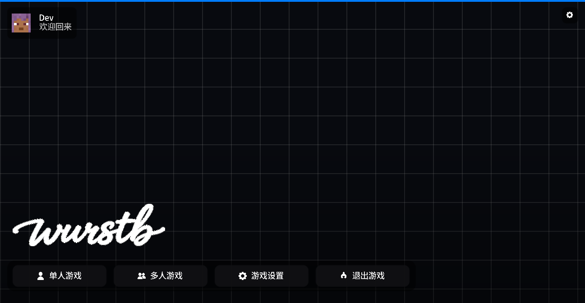
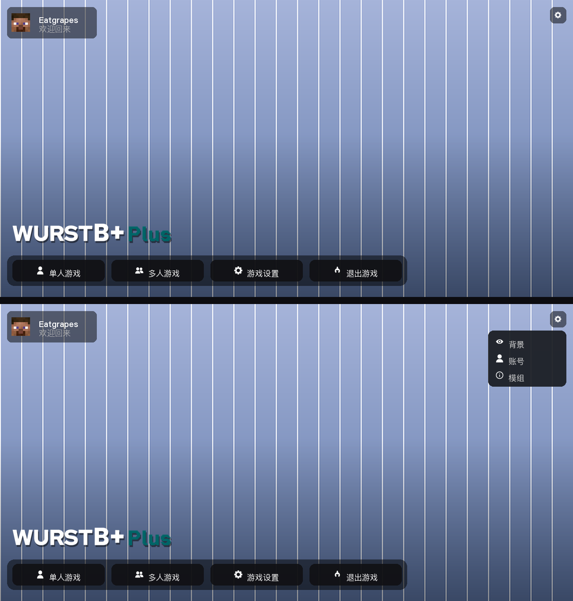
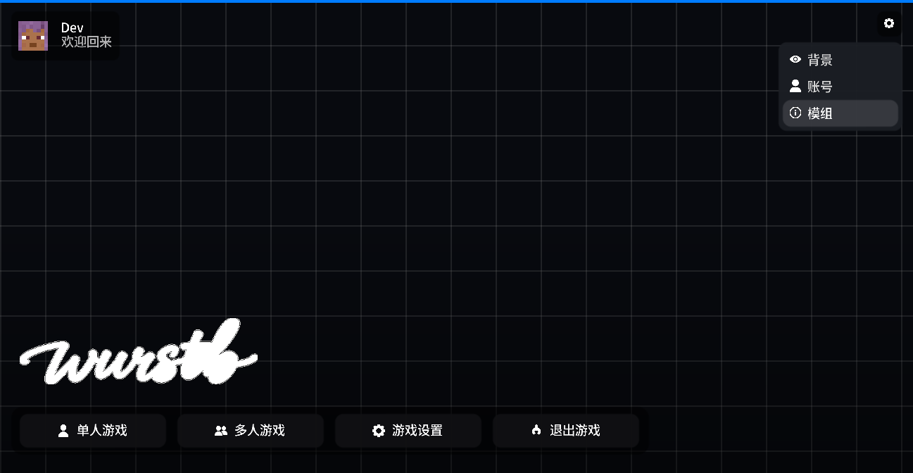

# 标题主界面（v1.6 根工程 Forge 1.20.1）

> 范围：Minecraft 标题界面（主菜单）的整体版式。代码在
> `net.wurstclient.gui.title`：`WurstTitleMenu`（画）+ `WurstTitleButton`（控件）
> + `TitleMenuLayout`（几何）+ `BackgroundSelectScreen`（背景选择）。
> 背景子系统本身见 [title-background.md](title-background.md)。

## 1. 版式来源

> 上图是**实机截图**（dev 客户端 + 游戏自己的 F2），版式与参考帧同尺寸
> （1297×672）。齿轮菜单展开的样子见第 6 节。

> 上图是**用 PIL 按 `TitleMenuLayout` 同一套算式画的 mock**（上：齿轮菜单收起；
> 下：点开），版式与配色示意用。实机截图见第 6 节。

用户给了一张参考主界面截图（1296×672 物理像素）。版式不是照着感觉调的，而是
**先在截图上量像素，再折成比例**，见 `TitleMenuLayout` 里的 `*_RATIO` 常量。
量到的数字：

| 元素 | 参考图上的物理像素 |
| --- | --- |
| 账号胶囊 | 左上角 `(16, 15)` 起，`218×70`，圆角约 10；头像 42×42 |
| 账号名 / 副标题 | 名 `Eatgrapes` 约 24px 高、白色；`Welcome back` 约 13px、灰 |
| 齿轮 | 右上角 `(1244, 16)` 起，`36×36`，右边距 16 |
| 动作条底板 | `x 20..920`（宽 904）、`y 579..646`（高 67），约 50% 黑 |
| 动作条按钮 | 4 个 `208×48`、间隔 16，约 82% 黑，圆角约 12；图标约 20px |
| 左下角标题 | `x 28..213`、`y 506..547`（字高 41） |

**为什么用比例而不是像素**：屏幕上的物理尺寸 = 比例 × 逻辑尺寸 × guiScale，
而 guiScale = 物理高度 / 逻辑高度，两者相乘把 guiScale 约掉。所以同一套比例在
任何分辨率、任何 GUI scale 下都落在同一个物理位置。`TitleMenuLayoutTest`
的第一条用例就是把「逻辑值 ×2」拿回 1296×672 的参考帧上对数（GUI scale 2 下
逻辑画布是 648×336），容差 4 物理像素。

文字是唯一的例外：Minecraft 的字体固定 9 逻辑像素高，不随屏幕缩放。所以各处
的 `*_MIN` / `*_MAX` 钳制是按「9 像素的字还放得下」定的，而不是按参考图定的
（`CHIP_HEIGHT_MAX` / `RAIL_HEIGHT_MAX` 的注释写了理由）。

## 2. 画面结构

从下往上：

1. **壁纸**：`BackgroundManager.render()`，没选或还没解码好时退回内置网格
   （`VisualRenderer.gridBackground`）。
2. **整体压暗** `0x33000000`，壁纸再亮白字也读得出来。
3. **底部渐变压暗**：从 45% 高度处 `0x00000000` → 屏幕底部 `0x66000000`
   （`GuiGraphics.fillGradient`，一个 quad）。
4. **账号胶囊**：50% 黑圆角块 + 皮肤头像（`PlayerFaceRenderer`）+ 账号名 +
   「欢迎回来」（`0xB3FFFFFF`）。
5. **左下角白色字标**：`assets/wurst/textures/gui/wurstb_logo_white.png`
   （700×195，v1.6 那张彩色手写体转成全白，做法见下）。
6. **动作条底板**：50% 黑圆角块，4 个按钮是控件，画在它上面。
7. **控件层**（原版 `Screen.render` 画）：4 个动作按钮、右上角齿轮、齿轮菜单的
   3 行（`visible` 开关）。

### 字标：矢量（当前方案）

**字标现在是描摹出来的 SVG，按实际绘制像素数光栅化**（`assets/wurst/logo/wurstb.svg`
+ `gui/title/TitleLogoVector`）。这条路是被位图的三种失败逼出来的，三次都踩在同一个
物理限制上：

1. **原分辨率直接嵌入 = 断笔 + 噪点**。用户给的图是 2101×660，而字标在屏幕上只占
   337（小窗）～1000（4K）物理像素——1080p 窗口下缩 4.1 倍。`GL_LINEAR` 每次只取
   2×2 个纹素，**四分之三的纹素根本采不到**：1～2 像素宽的连笔会整根消失（"urst"
   那一段全是缺口），原图 WebP 的压缩噪点会冒成一圈白点。实机放大对比：
   [title-logo-native-vs-baked.png](title-logo-native-vs-baked.png)（上＝原分辨率、
   下＝烘焙版）。
2. **烘死一个尺寸（试过 768×229 Lanczos）能用，但换个窗口就失配**：小窗缩得不够、
   大窗又不够锐。
3. **矢量解决了尺寸问题，但"太锐"也不行**：等尺寸光栅化 + 盒子平均会给出 1 像素宽
   的硬过渡——数学上正确，可这套字标的发丝在这个尺寸下只有 0.3～1 像素，硬过渡会把
   "发丝不够粗"暴露得最清楚（实测过渡/实心只有 4.9%，位图版是 22%）。所以缩小这一步
   用**三角核半径 1**（`TitleLogoVector.FILTER_RADIUS`）把过渡铺到约两个像素。

实现要点：

- 描摹：Moore 邻域边界跟踪 + Douglas-Peucker，容差 **0.4 像素**（SVG 51 KB，
  3588 个点），与原始 alpha 的 **IoU 0.992**；5 条轮廓合成一条
  `fill-rule="evenodd"` 的 path，字母内孔自动成洞。
- 解析只支持 `M/L/Z`（本仓库生成的文件只用这三个命令）。
- 光栅化：Java2D `Path2D` + `BufferedImage`，2 倍超采样后按三角核缩小到目标尺寸，
  每次窗口尺寸变化重建一张 `DynamicTexture`（缓存，尺寸不变不重做）。
- 尺寸换算：绘制像素 = GUI 逻辑宽 × `guiScale`，实测这台机器上是 `169×2=338`
  （1296×672 窗口）与 `127×4=508`（1945×1008 窗口），与渲染目标一一对应。
- 读不到 SVG 时退回仓库里那份 768×229 位图（`FALLBACK`）。

**不要用盒核或很宽的三角核做烘焙**：盒子平均把 1 像素宽的发丝挤成两端（实机剖线是
硬跳变），半径 2 的三角核则会把发丝平均到看不见（试过，笔画直接消失）。

**外部给的 "lossless.svg" 查过了，不能用**：那个文件整个只有一个 `<image>` 元素，
里面是 base64 的 **JPEG 位图**（不是 path），而且解出来是**白底白字**（亮度 240–255、
没有任何暗像素）。所以它既不是矢量、也不能当素材。真要用外部矢量源，需要设计师导出
带贝塞尔命令的 SVG（那时解析器要扩展 `C/S/Q/T`），或者至少给一张透明底 PNG。

旧素材（仓库根目录 `logo.png` 转白那版）的两个坑仍记在这里，换素材时可能还会遇到：

1. **字母内部有填充**：原图字母的"孔"不是透明区域，而是**不透明的白色填充**（t 的
   内三角、b 的圈里都是白块）。只拿 alpha 当遮罩，那些白块会被一起刷成白色，
   于是字标变成一坨。正确做法是遮罩 = `alpha × 非纯白`，纯白判定用三通道同时
   > 232（彩色笔画即使很浅也至少有一个通道明显低于它）。
2. **不要做任何"加粗"**：3×3 最大值滤波会把 s、b 的圈糊死，边缘也会变硬。

## 3. 交互

- **动作条**：`单人游戏` / `多人游戏` / `游戏设置` / `退出游戏`，分别走
  `ScreenRegistry.WORLD_SELECTION` / `MULTIPLAYER` / `OPTIONS`、`Minecraft::stop`。
  **Minecraft Realms 的入口去掉了**（用户选择）。
- **右上角齿轮**：点开一个下拉卡片，里面 3 行：`背景`（`BackgroundSelectScreen`）、
  `账号`（`AltManagerScreen`）、`模组`（Forge `ModListScreen`）。菜单用
  `AbstractWidget.visible` 开关，不动态增删控件——渲染途中改控件表会
  `ConcurrentModificationException`。
- 点击空白处**不会**关掉齿轮菜单（要再点一次齿轮）。原因是「点外面关掉」需要在
  `Screen.mouseClicked` 上注入，而那是所有界面共用的方法，代价比收益大。
- 悬停动画沿用 `clickgui2.animation.HoverAnimation`（20 帧）。

## 4. 文案与 i18n

界面文案全部走 `Component.translatable`，键在
`assets/wurst/lang/en_us.json` 与 `zh_cn.json`（**新建**，这个仓库此前没有任何
语言文件）：

| 键 | en_us | zh_cn |
| --- | --- | --- |
| `wurst.title.singleplayer` | Singleplayer | 单人游戏 |
| `wurst.title.multiplayer` | Multiplayer | 多人游戏 |
| `wurst.title.settings` | Settings | 游戏设置 |
| `wurst.title.quit` | Quit | 退出游戏 |
| `wurst.title.accounts` | Accounts | 账号 |
| `wurst.title.mods` | Mods | 模组 |
| `wurst.title.background` | Background | 背景 |
| `wurst.title.menu` | Menu | 菜单 |
| `wurst.title.welcome` | Welcome back | 欢迎回来 |

语言跟随 Minecraft 的语言设置（`Component` 在渲染时按当前 `LanguageManager`
解析）。**字体用原版那套**（即 `GuiPreferences` 里的内置项 `CozyUI`：选中它时
`applyFont` 直接返回原组件、不做任何字体覆盖），理由是清晰度——苹方 provider 的
图集只有 9px×2 oversample = 18px，GUI scale 4 时字被放大到 36 物理像素，必然发
虚；原版位图字体在任何 GUI scale 下都是整数倍像素放大。中文交给原版的 unicode
位图字体，同样清晰。

`BackgroundSelectScreen` 用的是同一套机制，键在 `wurst.background.*`（标题、
扫描按钮与状态、默认卡片、导入卡、视频徽章与说明、导入/删除的结果提示，带
`%s` 的用 `Component.translatable(key, args).getString()` 解析）。两边的键与
`%s` 数量由 `TitleLangFilesTest` 看着：少一个键在另一种语言里就会把键名本身画
到屏幕上。

## 5. 与参考图的差异（如实说明）

1. **头像是圆角方块，不是正圆。** Minecraft 的 GUI 只有矩形裁剪
   （`enableScissor`），没有纹理圆形遮罩；皮肤脸部贴图只有 8×8 像素，按列切片
   拼圆的粒度太粗（每片 1 个源像素）。参考图那种正圆需要 Skia 路径或预生成
   遮罩贴图，本版没做。
2. **图标用的是仓库原有的 Wurst 实心图标**（`textures/gui/fdp/`），参考图那套是
   细描边线性图标。额外只生成了一个 `fdp/power.png`（电源符号，参考图的「退出」
   用它，仓库里没有）。
3. **图标素材是 88×88，实际画到约 20–40 物理像素**，双线性缩小时会略软
   （Minecraft 的纹理没有 mipmap）。
4. **左下角没有版本号/Forge 版本那一行**（参考图上没有）。旧版主界面右下角有
   `WurstB+ Plus`、左下角有 `Minecraft x / Forge y`，这次都去掉了。
5. **只有 4 个主按钮**：参考图是 4 个，Realms 与旧的「账号 / 模组」两个小按钮
   合并进了齿轮菜单。
6. **文字尺寸不随屏幕缩放**：GUI scale 越低，文字相对版式越小（这是原版字体的
   限制，见第 1 节）。
7. **字标是矢量**（描摹的 SVG，见上面那节），按屏宽的 26% 画（337~1000 物理像素），
   按实际绘制尺寸光栅化，所以放大不会发虚。
8. **`BackgroundSelectScreen` 已按参考图改成圆角对话框**：圆角面板与卡片、卡片底部
   标题条、选中/悬停的强调色描边、圆角「+」导入卡、圆角按钮。缩略图改按 **cover**
   裁切（之前是把整张缩略图铺满预览框，正方形预览图会被横向拉宽近两倍——工坊场景的
   `preview.gif` 正好是 250×250，实机一眼可见）。仍然保留「扫描 Steam 库」「运动」
   两个按钮，参考图里没有它们，但功能要留着。
9. **其他 14 个平台工程还是旧主界面**：`fabric/`、`neoforge/` 与
   `versions/*/gui/title/` 下各有一份 `WurstTitleMenu` / `WurstTitleButton` 的
   拷贝，这次只改了根工程（1.20.1 Forge）。移植时要一起带过去，否则主界面会
   按平台分成两套。

## 6. 验证状态

上面两张是**实机截图**，不是 mock：dev 客户端（`gradlew runClient`）跑起来、窗口
调到 864×448（帧缓冲 1297×672，正好和参考帧同尺寸），再用**游戏自己的 F2 截图**
（`Screenshot.grab` 读帧缓冲）拿到的。第二张里的齿轮菜单是临时把 `menuOpen` 强制
置真后拍的。

- 通过：`gradlew test`（`TitleMenuLayoutTest`：参考帧对数、4 个按钮等宽、动作条
  底边距、胶囊与齿轮共用上边距、胶囊宽度随账号名增长并有上限、菜单挂在齿轮下方
  且不压动作条、9 种画布尺寸下各区域互不重叠且不出屏、比例缩放、退化画布不产生
  零/负尺寸、文字垂直居中；`TitleLangFilesTest`：两种语言键集合、空值、`%s` 数量、
  源码用到的键都存在）。
- 实机确认过的：网格背景、账号胶囊（皮肤头像 + 账号名 + 欢迎回来）、齿轮与它的
  下拉菜单（背景/账号/模组三行，含悬停高亮）、左下角白色字标、动作条与 4 个按钮
  （图标 + 文字）、原版字体在任何 GUI scale 下的清晰度。
- **一个踩过的坑记在这里**：`PrintWindow`（抓窗口自身内容）对 OpenGL 窗口会返回
  **残缺/陈旧的帧**——它曾经让我以为"只有背景和胶囊画出来了、动作条和字标没渲染"，
  为此白跑了两轮诊断。要判定 Minecraft 界面的真实内容，只能用游戏自己的 F2 截图。
  另外 `SetForegroundWindow` 会被 Windows 前台锁拒绝，需要
  `AttachThreadInput` + `BringWindowToTop` 才拿得到焦点（F2 才送得进游戏）。
